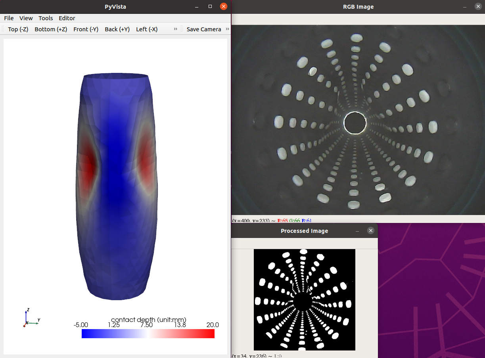

# taclink_sensing
Inference program for vision-based large-scale tactile sensing (TacLink). The sensing rate (processing speed) can reach up to 100Hz without 3D visualization. It would be recommended to run on a Ubuntu-based PC for the maximum processing speed. 

## Dependency
The program was run successfully with Python 3.8, NVIDIA-SMI 470.182.03, CUDA Version: 11.4 and the following dependencies:
- requirements.txt
- pytorch
- v4l-utils

## Getting Started
1. Clone the repository, download the trained model file (.pt), and put it into the `network` directory.
You can download the model file [here](https://drive.google.com/file/d/1iZBT_pqcG2R2QJSgO0L0dhWyMvGUcvT5/view?usp=sharing)

2. Add PYTHONPATH, add the following command to the `~/.bashrc` file
```
export PYTHONPATH=[your/path/]taclink_sensing:$PYTHONPATH
```

3. Install dependencies
```
pip3 install -r requirements.txt
```
```
pip3 install torch torchvision
```
```
sudo apt-get update
sudo apt-get install v4l-utils
```

4. Plug the camera cables into the PC. **Note that we now only use one camera (`cam A`) for the sensing program. But the other one should also be connected to power the inner LED board**. Otherwise, an external power source is needed for the LED board. It is essential to power the LED board to allow the sensor to work properly. You can check the USB Camera ID as follows
```
cd taclink_sensing/inference
python test_cam.py
```

5. Run the inference code and enjoy! The program should pop up the 3D visualization and camera video windows.
```
cd taclink_sensing/inference
python main.py
```


## Reference
The latest paper can be found [here](https://ieeexplore.ieee.org/stamp/stamp.jsp?tp=&arnumber=10054516)
```
@ARTICLE{quan23tro,
  author={Luu, Quan Khanh and Nguyen, Nhan Huu and Ho, Van Anh},
  journal={IEEE Transactions on Robotics}, 
  title={Simulation, Learning, and Application of Vision-Based Tactile Sensing at Large Scale}, 
  year={2023},
  volume={39},
  number={3},
  pages={2003-2019},
  doi={10.1109/TRO.2023.3245983}}
```
